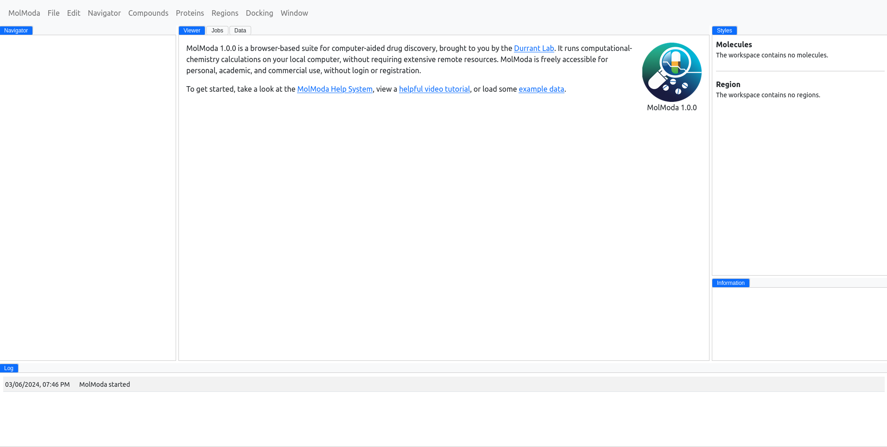

# Interface

MolModa has an intuitive interface where all relevant information for you project is shown in various windows.
There are five main windows:

-   [Main](./main/),
-   [Navigator](./navigator/),
-   [Styles](./styles/),
-   [Information](./info/),
<!-- -   [Log](./log/). -->

<figure markdown>
{ alight=left height=300 }
</figure>
