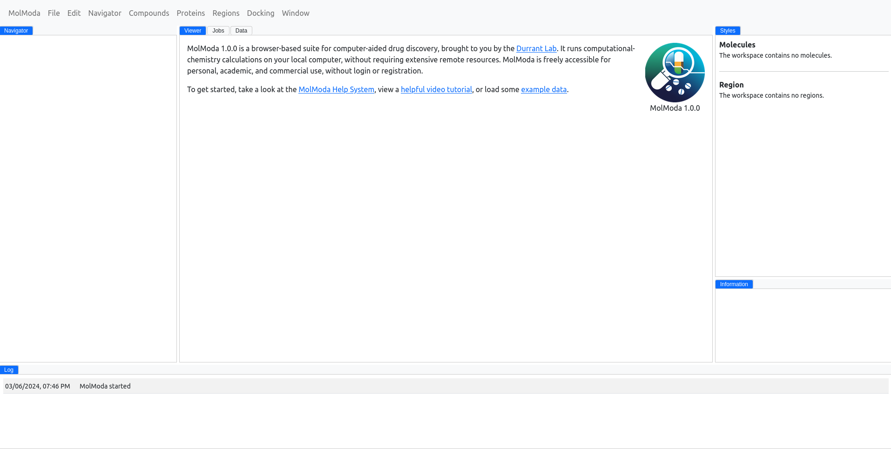

# Interface

MolModa has an intuitive interface where all information for your project is shown in several panels. There are seven panels:

- [Navigator](navigator/) — the list of molecules and regions in the project.
- [Main](main/) — the 3D viewer, the jobs queue, and the data tables.
- [Styles](styles/) — visual representation controls for the selected molecules.
- [Information](info/) — molecular properties and 2D structure for the selected compound, or sequence for a selected protein.
- [Log](log/) — a running record of application messages and events.

You can switch between panels from the `Window` menu, and reset the layout at any time with `Window` :material-arrow-right: `Reset Layout`.

<figure markdown>
{ alight=left height=300 }
</figure>
