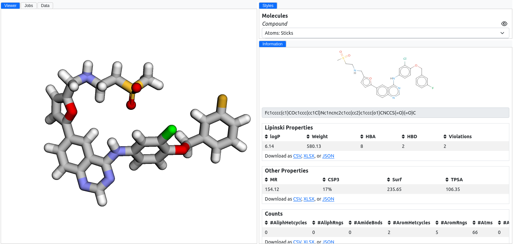

# Information

The Information section of our application is a dedicated space designed to offer users immediate access to critical molecular property information.
This feature enriches the user's understanding of molecular structures through a concise and informative display, encompassing a range of data points, including 2D representations, SMILES strings, and computed molecular properties.

## Molecular properties

For more information, go to the [molecular properties documentation](../../structures/molprop/).

<figure markdown>
{ alight=left height=300 }
</figure>
