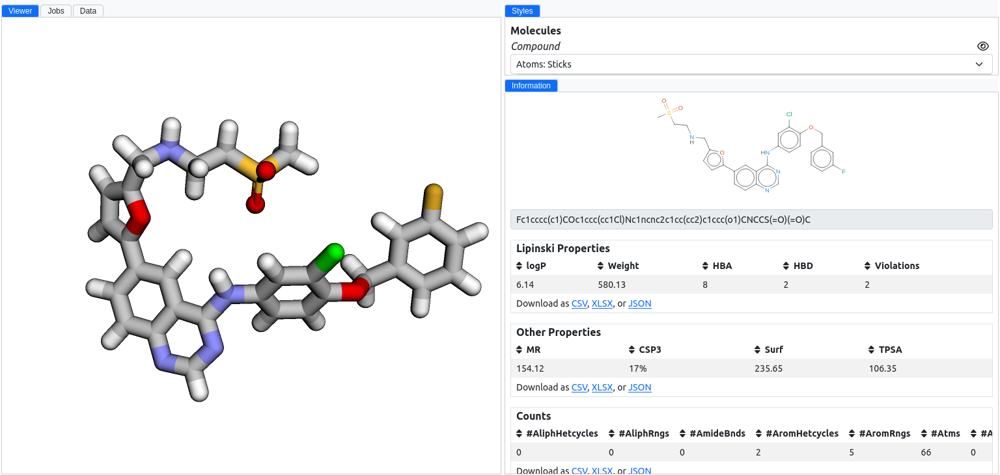

# Information

The Information panel gives you immediate access to molecular property data for the selected compound. It shows a 2D depiction, the SMILES string, and computed molecular properties in a concise display.

## Molecular properties

For more information, go to the [molecular properties documentation](../../structures/molprop/).

<figure markdown>
{ alight=left height=300 }
</figure>
