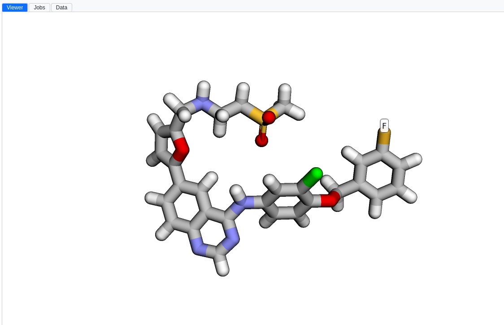
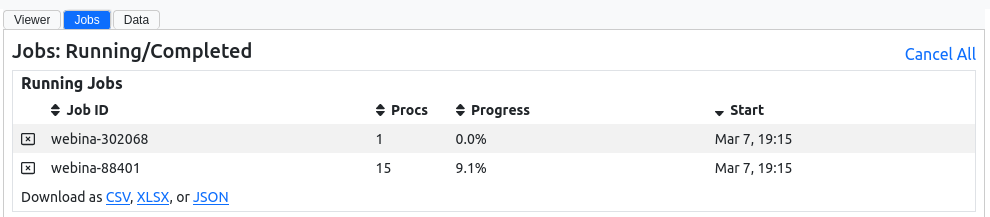
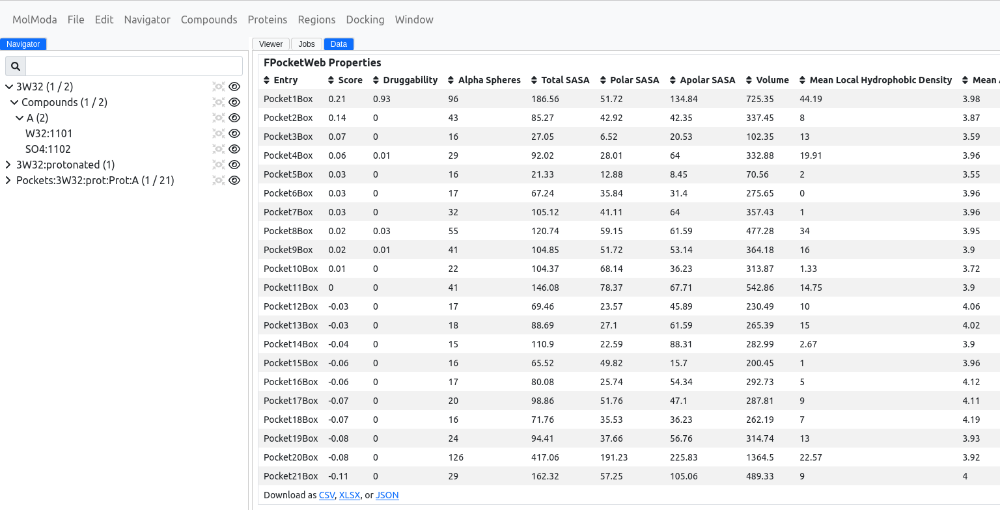
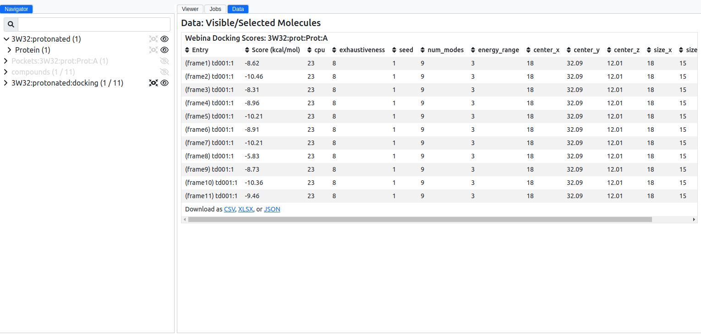

# Main

The main window is the core interface of the application, designed to provide quick access to the [viewer](#viewer), [jobs](#jobs), and [data](#data).

## Viewer

The viewer is essential for visualizing molecules such as proteins and compounds. Through the [Styles panel](../styles/), it offers a range of customizable visual representations, allowing for detailed views of molecular structures. The viewer works together with the [Navigator](../navigator/): selecting an entry in the Navigator updates the corresponding visuals in the viewer.

You can export the current scene as a PNG image (`File` :material-arrow-right: `Graphics` :material-arrow-right: `Save a PNG Image` ([guided tour](https://molmoda.org/?tour=savepng){:target="_blank"})) or as a VRML2 3D model (`File` :material-arrow-right: `Graphics` :material-arrow-right: `Save a VRML2 Model` ([guided tour](https://molmoda.org/?tour=savevrml){:target="_blank"})) for use in external rendering software.

<figure markdown>
{ alight=left height=300 }
</figure>

## Jobs

The Jobs panel tracks the progress of running tasks in real time, including docking calculations, with their completion status and runtime. A job history is also available, providing a record of past jobs for analysis and review.

<figure markdown>
{ alight=left height=300 }
</figure>

## Data

The Data panel organizes information from calculations including binding pockets, compound properties, docking scores and poses, and analysis output such as 2D interaction diagrams and ROC/enrichment-factor curves. Tables are sortable and filterable, making it easier to review results and select entries for further inspection.

=== "Pocket"

    <figure markdown>
    { alight=left height=300 }
    </figure>

=== "Docking"

    <figure markdown>
    { alight=left height=300 }
    </figure>
