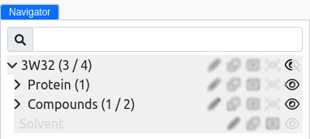
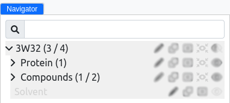
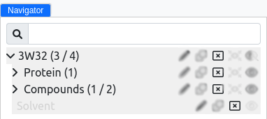

# Navigator

The Navigator is an integral feature of MolModa. It gives you control over the molecules and regions in your project and acts as a dynamic inventory, listing every loaded or computed entity—proteins, ligands, docking poses, regions, and any other structures produced by computational steps.

The panel is organized to give a clear view of the project's molecular components, making it straightforward to identify and select items for further action.

## Per-item features

=== "Hide/Show"

    Toggle the visibility of a structure or region so the viewer stays focused on the elements of interest.

    <figure markdown>
    { alight=left height=300 }
    </figure>

=== "Focus"

    Center the view on the selected structure or region. Useful for examining detailed interactions or specific configurations.

    <figure markdown>
    { alight=left height=300 }
    </figure>

=== "Delete"

    Remove a structure or region from the project ([guided tour](https://molmoda.org/?tour=deletemol){:target="_blank"}). This action is irreversible; if you only want to declutter the viewer, use Hide/Show instead.

    <figure markdown>
    { alight=left height=300 }
    </figure>

## Molecule operations

The `Edit` menu provides additional operations on Navigator entries:

- `Rename Molecule` ([guided tour](https://molmoda.org/?tour=renamemol){:target="_blank"}) — change the name shown in the tree.
- `Clone Molecule` ([guided tour](https://molmoda.org/?tour=clonemol){:target="_blank"}) — duplicate one or more selected molecules.
- `Merge Molecules` ([guided tour](https://molmoda.org/?tour=mergemols){:target="_blank"}) — combine the selected molecules into a single new entry.
- `Copy to Clipboard` / `Paste from Clipboard` ([guided tour](https://molmoda.org/?tour=copyclipboard){:target="_blank"}) — move molecules between projects or sessions.
- `Copy SMILES to Clipboard` ([guided tour](https://molmoda.org/?tour=copyassmiles){:target="_blank"}) — copy the SMILES strings of the selected compounds.

If you make a mistake, `Edit` :material-arrow-right: `Undo` ([guided tour](https://molmoda.org/?tour=undo){:target="_blank"}) will reverse the last action.

## Selection

Several plugins under `Edit` :material-arrow-right: `Selection` make it easier to manage large projects:

- `Select All` ([guided tour](https://molmoda.org/?tour=selectall){:target="_blank"}), `Select Visible` ([guided tour](https://molmoda.org/?tour=selectvisible){:target="_blank"}), `Select Invisible` ([guided tour](https://molmoda.org/?tour=selectinvisible){:target="_blank"})
- `Invert Selection` ([guided tour](https://molmoda.org/?tour=selectinverse){:target="_blank"})
- `Clear Selection` ([guided tour](https://molmoda.org/?tour=clearselection){:target="_blank"})

## Tree navigation

The `View` menu includes shortcuts for working through the tree:

- `Toggle Up` ([guided tour](https://molmoda.org/?tour=uptreenav){:target="_blank"}) / `Toggle Down` ([guided tour](https://molmoda.org/?tour=downtreenav){:target="_blank"}) — move visibility and focus to the molecule above or below the current one. Handy for stepping through docking poses or a compound library.
- `Toggle Visible` — quickly show or hide the current selection.
- `Expand All` ([guided tour](https://molmoda.org/?tour=expandall){:target="_blank"}) / `Collapse All` ([guided tour](https://molmoda.org/?tour=collapseall){:target="_blank"}) — change how deeply the tree is unfolded.

## Visualizations

For repeatable styling, `View` :material-arrow-right: `Visualizations` :material-arrow-right: `New Visualization` lets you define a visualization by specifying selection criteria, representation, and color, then apply it across the project.

## Best practices

- **Regularly review**: Keep the Navigator organized by reviewing the structures and regions you have loaded, ensuring only relevant entities are present.
- **Use Hide/Show**: Focus on specific areas of interest without permanently removing structures from the project.
- **Caution with deletion**: Deletion is permanent. When in doubt, hide instead.
