# Styles

MolModa's Styles feature allows users to customize the visual representation of molecular structures, including proteins and compounds.
This documentation provides an overview of the visual styles available for proteins, each designed to highlight different aspects of molecular structure for enhanced analysis and presentation.

<figure markdown>
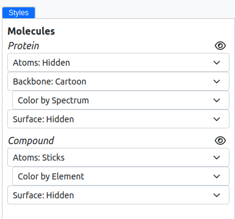{ alight=left height=300 }
</figure>

## Cartoon

The Cartoon style abstractly represents protein structures, emphasizing the overall fold and secondary structural elements.

=== "Spectrum"

    Displays the protein in a gradient of colors along its length, helpful in distinguishing different parts of the molecule.

    <figure markdown>
    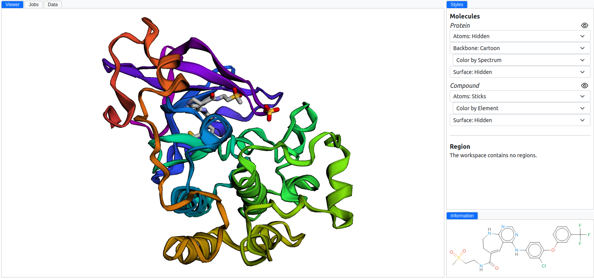{ alight=left height=300 }
    </figure>

=== "Secondary"

    Highlights the secondary structures (e.g., α-helices and β-sheets) using distinct colors and shapes.

    <figure markdown>
    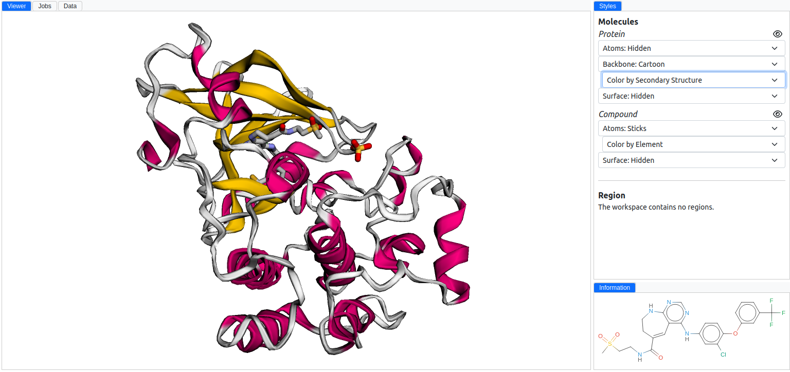{ alight=left height=300 }
    </figure>

=== "Chain"

    Colors the protein based on its chain composition, aiding in identifying multi-chain complexes.

    <figure markdown>
    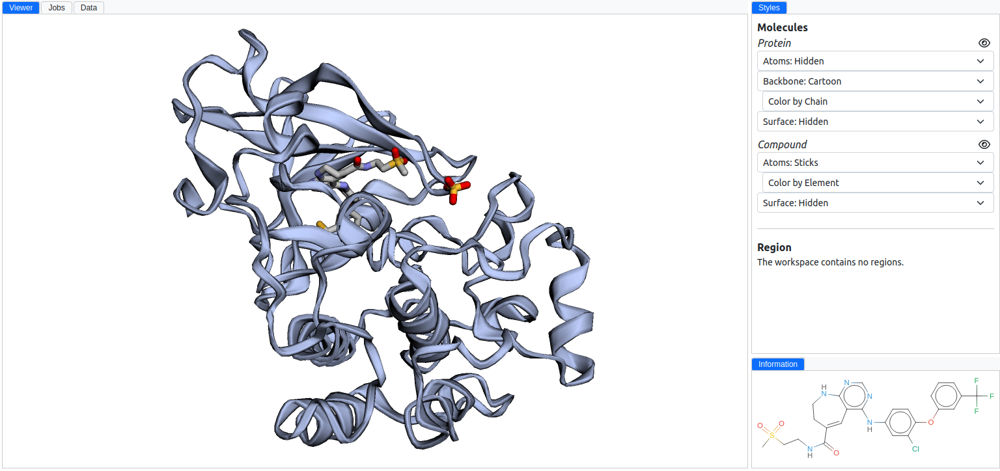{ alight=left height=300 }
    </figure>

=== "Solid"

    Presents the protein in a single, solid color for a simplified view.

    <figure markdown>
    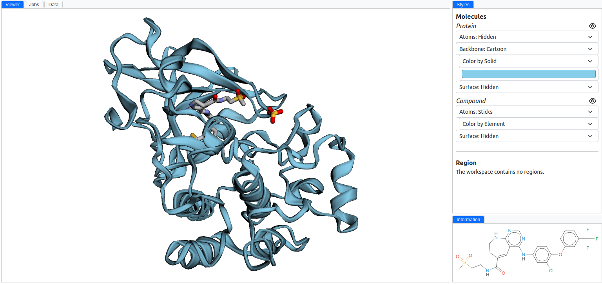{ alight=left height=300 }
    </figure>

## Surface

Surface styles provide a detailed view of the molecular surface, highlighting properties such as element types or charge distributions.

=== "Element"

    Colors the surface based on the type of elements, offering insights into the chemical composition.

    <figure markdown>
    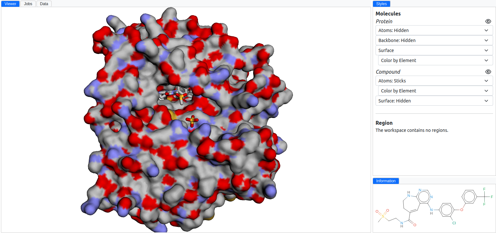{ alight=left height=300 }
    </figure>

=== "Carbons"

    Differentiates carbon atoms from other elements, useful for organic molecules analysis.

    <figure markdown>
    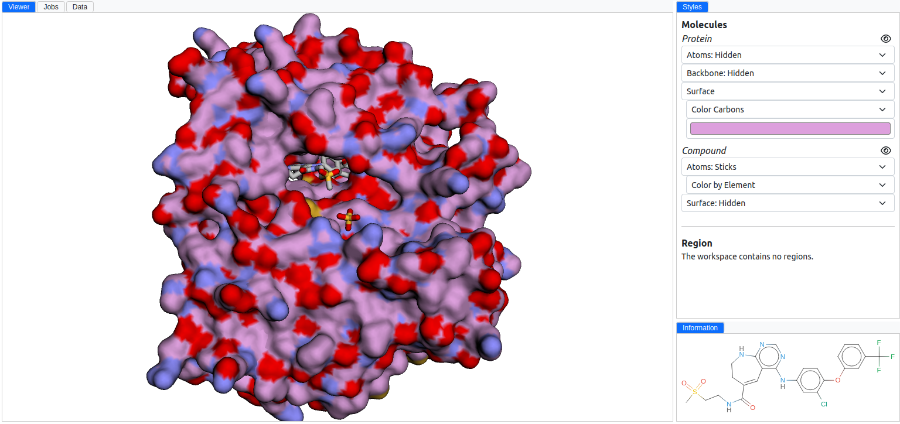{ alight=left height=300 }
    </figure>

=== "Secondary structure"

    The surface is colored according to secondary structural elements, making it easy to identify helices, sheets, and coils.

    <figure markdown>
    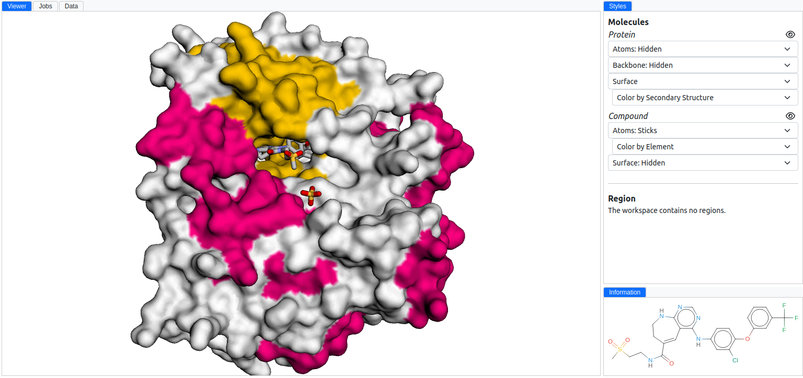{ alight=left height=300 }
    </figure>

=== "Chain"

    Indicates the chain identity through color coding, which is helpful in visualizing protein complexes.

    <figure markdown>
    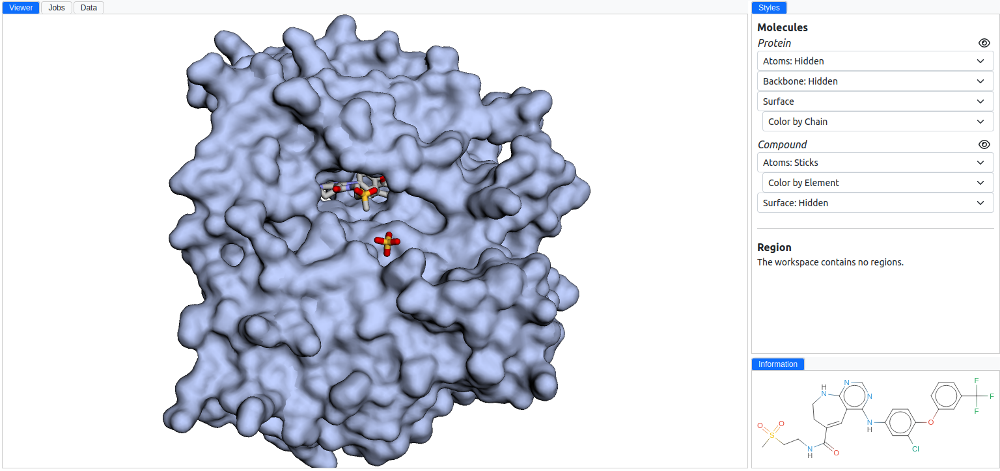{ alight=left height=300 }
    </figure>

=== "Solid"

    A uniform color for the entire surface, focusing on the shape and contours of the molecule.

    <figure markdown>
    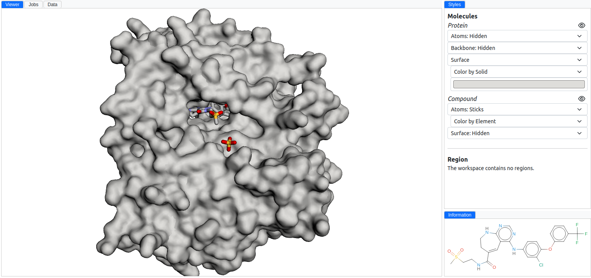{ alight=left height=300 }
    </figure>

## Atoms

Atom styles depict individual atoms and bonds, offering detailed insights into molecular architecture.

=== "Sticks"

    Represents bonds as sticks and atoms as small spheres, ideal for detailed structural analysis.

    <figure markdown>
    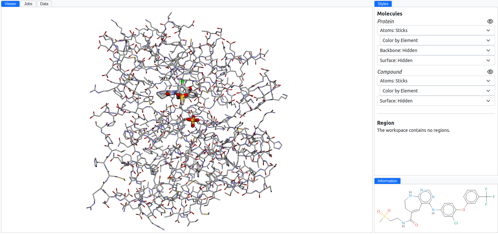{ alight=left height=300 }
    </figure>

=== "Lines"

    Uses lines to represent bonds between atoms, providing a simplified view of the molecular structure.

    <figure markdown>
    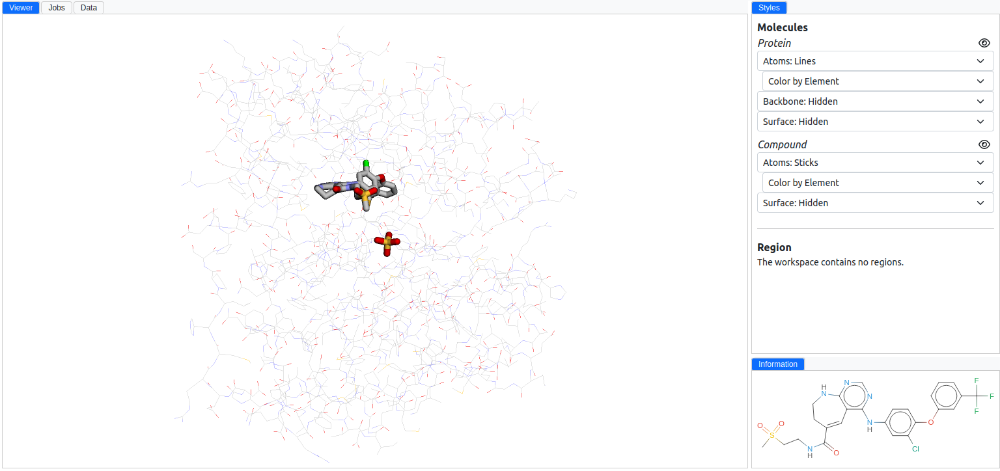{ alight=left height=300 }
    </figure>

=== "Spheres"

    Displays atoms as spheres, scaled according to their van der Waals radii, highlighting the molecular volume.

    <figure markdown>
    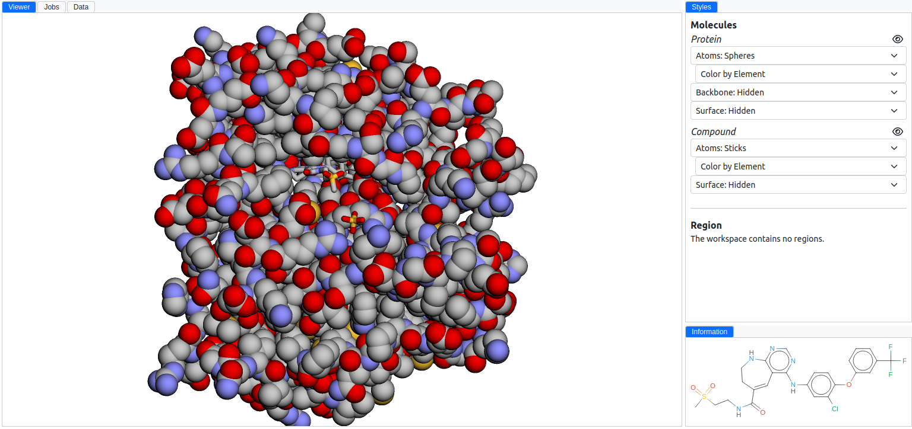{ alight=left height=300 }
    </figure>
