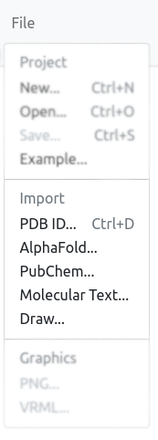
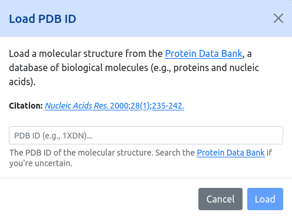
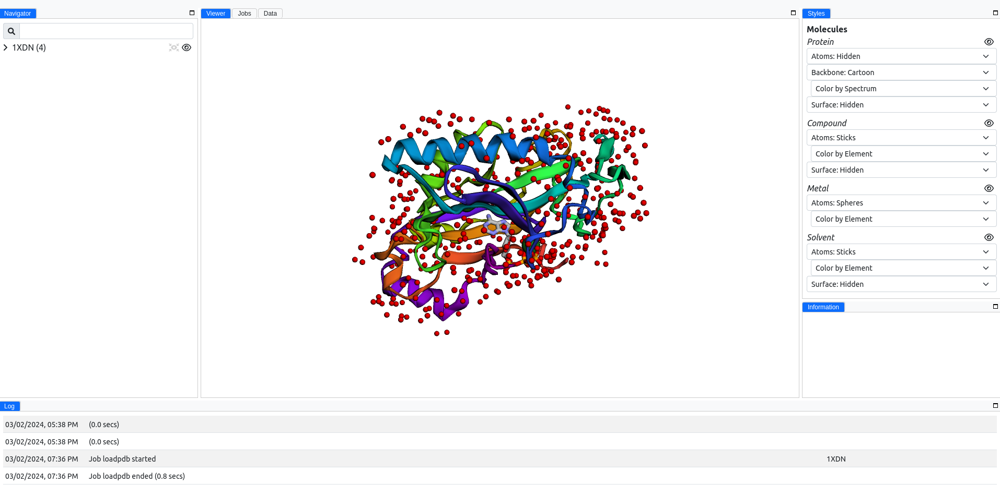
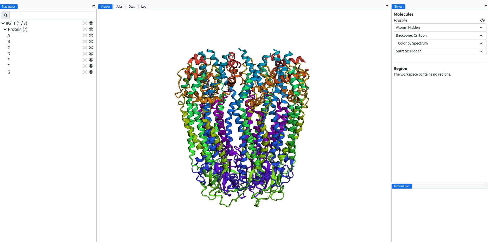
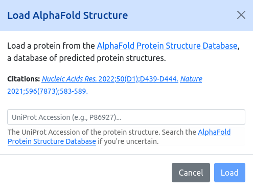
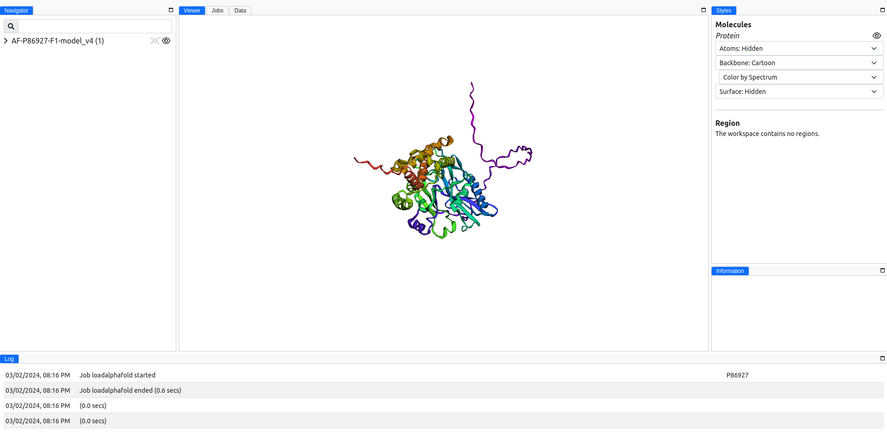

# Proteins

The `File` menu, shown below, contains several ways to import or load biomolecular structures into MolModa.

<figure markdown>
{ alight=left height=300 }
</figure>

## Protein Data Bank

You can load structures directly from the [Protein Data Bank (PDB)](https://www.rcsb.org/) by clicking `File` :material-arrow-right: `Import` :material-arrow-right: `Load PDB IDs` ([guided tour](https://molmoda.org/?tour=loadpdb){:target="_blank"}).

<figure markdown>
{ alight=left height=300 }
</figure>

For example, we can load in [1XDN](https://www.rcsb.org/structure/1XDN), a RNA editing ligase 1 from *Trypanosoma brucei*.

<figure markdown>
{ alight=left width=800 }
</figure>

MolModa will automatically load all chains; [8GTT](https://www.rcsb.org/structure/8GTT) for example, will have all seven chains shown by expanding `8GTT` in the [Navigator](../../../interface/navigator/).

<figure markdown>
{ alight=left width=800 }
</figure>

## AlphaFold

Not all structures are available in the PDB.
You can also load predicted structures directly from the [AlphaFold Protein Structure Database](https://alphafold.ebi.ac.uk/) by clicking `File` :material-arrow-right: `Import` :material-arrow-right: `Load AlphaFold Structure` ([guided tour](https://molmoda.org/?tour=loadalphafold){:target="_blank"}).

<figure markdown>
{ alight=left height=300 }
</figure>

Let's load the same RNA-editing ligase, but from the AlphaFold Protein Structure Database.
We do this by providing the UniProt accession number, [P86927](https://alphafold.ebi.ac.uk/entry/P86927).

<figure markdown>
{ alight=left height=300 }
</figure>

## Finding similar proteins

If you have one protein and want to find related structures, use `Proteins` :material-arrow-right: `Find Similar Proteins`. This runs an RCSB PDB sequence search and lets you load any of the hits without leaving the application. It's a useful way to build a small panel of homologs for comparison or cross-docking.

## Aligning multiple proteins

When you have several related structures loaded, `Proteins` :material-arrow-right: `Align Proteins` ([guided tour](https://molmoda.org/?tour=alignproteins){:target="_blank"}) superimposes them onto a reference (template) structure. This makes structural comparison straightforward and ensures that subsequent operations (such as defining a shared docking region) are performed in a common coordinate frame.

## Protonation

Crystallographic and predicted structures typically lack explicit hydrogens, and protonation states depend on pH. `Proteins` :material-arrow-right: `Protonate/Deprotonate Proteins` ([guided tour](https://molmoda.org/?tour=reduce){:target="_blank"}) assigns protonation states appropriate for the pH you specify, in preparation for docking or other downstream calculations.

## Pocket detection

Once a protein is loaded and prepared, you can identify candidate binding sites with `Proteins` :material-arrow-right: `Pocket Detection` ([guided tour](https://molmoda.org/?tour=fpocketweb){:target="_blank"}). Detected pockets appear in the Navigator and the Data panel, and can be used as the basis for a docking [region](../../regions/). See the [pockets section](../../pockets/) for details on the underlying method.

<!-- LINKS -->

[navigator]: /interface/navigator
